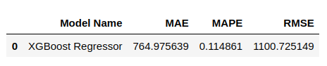

**Observação: Essa solução é fictícia e desenvolvida com dados abertos disponibilizados através da plataforma Kaggle**

## ****Contexto de negócio****

---

Rossmann é uma das maiores redes de drogarias da Europa. Com cerca de 56.200 funcionários e mais de 4.000 lojas. Em 2019, a Rossmann teve um faturamento de mais de € 10 bilhões na Alemanha, Polônia, Hungria, República Tcheca, Turquia, Albânia, Kosovo e Espanha. Com essa grande quantidade e variedade de lojas, é muito importante que a gestão da empresa tenha uma base de quanto irá vender no futuro, com isso surgiu uma questão de negócio que o CFO da empresa precisa resolver no momento.

O CFO da Rossmann precisa fazer reforma nas lojas,com isso ele solicitou para os gerentes de todas as lojas uma previsão de vendas para as próximas 6 semanas, com essa previsão ele vai saber quanto vai poder investir na reforma das lojas. Porém os gerentes com suas ferramentas atuais não conseguem fazer essa previsão, com isso foi solicitado a equipe de Data Scientists para criar uma solução para essa dor atual do time de negócio da empresa.

## ****Dados****

---

O conjunto de dados foi disponibilizado na plataforma Kaggle atravpes do seguinte link: [https://www.kaggle.com/c/rossmann-store-sales/data](https://www.kaggle.com/c/rossmann-store-sales/data) 

Abaixo um dicionário dos dados

- **Id** - um Id que representa (Store, Date) dentro do conjunto de teste
- **Store** - Id único para cada loja
- **Sales** - o volume de negócios em um determinado dia.
- **Customers** - o número de clientes em um determinado dia
- **Open** - um indicador para saber se a loja estava aberta: 0 = fechada, 1 = aberta
- **StateHoliday** - indica um feriado estadual. Normalmente todas as lojas, com poucas exceções, fecham nos feriados estaduais. Observe que todas as escolas fecham nos feriados e finais de semana. a = feriado, b = feriado da Páscoa, c = Natal, 0 = Nenhum
- **SchoolHoliday** - indica se (Loja, Data) foi afetado pelo fechamento de escolas públicas
- **StoreType** - diferença entre 4 modelos de loja diferentes: a, b, c, d
- **Assortment** - descreve um nível de sortimento: a = básico, b = extra, c = estendido
- **CompetitionDistance** - distância em metros até a loja concorrente mais próxima
- **CompetitionOpenSince[Month/Year]** - o ano e mês aproximados em que o concorrente mais próximo foi aberto
- **Promo** - indica se uma loja está fazendo uma promoção naquele dia
- **Promo2** - Promo2 é uma promoção contínua e consecutiva para algumas lojas: 0 = a loja não está participando, 1 = a loja está participando
- **Promo2Since[Year/Week]** - descreve o ano e a semana em que a loja começou a participar da Promo2
- **PromoInterval** - descreve os intervalos consecutivos de início da promoção 2, nomeando os meses em que a promoção é iniciada novamente. Por exemplo. "Fev, maio, agosto, novembro" significa que cada rodada começa em fevereiro, maio, agosto, novembro de qualquer ano para aquela loja

## ****Planejamento da solução****

---

1. Entendimento do negócio e problemas e serem resolvidos - Ter um entendimento do negócio é essencial para começar planejar a solução. Observar quais dados tem uma maior importâcia para que possamos aplicar técnicas de Machine Learning e ter um melhor resultado final.
2. Coleta dos dados -  Através do download do conjunto de dados que está disponibilizado na plataforma Kaggle
3. Limpeza dos dados -  Identificamos outliers(dados discrepantes), dados faltantes e fazemos outros tratamentos com os dados pois assim quando chegar na etapa de treinamento do modelo de Machine Learning, obtermos o melhor desempenho possível.
4. Análise Exploratória dos Dados - Analisamos os atributos do conjunto de dados e geramos insights de acordo com a importância das variáveis do conjunto de dados, para com isso termos uma ideia da importância de cada variável na etapa de aplicar as técnicas de Machine Learnig.
5. Preparação dos dados para os algoritmos de Machine Learning - Os dados foram transformados, balanceados e normalizados para atender os requisitos de um algoritmo de Machine Learning, para que o modelo tenha um melhor desempenho no seu aprendizado.
6. Aplicação dos algoritmos de machine learning - Nessa etapa foi aplicado vários algoritmos de Machine Leaning para achar um melhor resultado, foi usado técnicas de Cross Validation para escolher o melhor modelo e também técnicas de Hyperparameter Fine Tunning, para encontrar os melhores parâmetros para usar no modelo.
7. Avaliação do algoritmo - O algoritmo é avaliado com base em algumas métricas e nesse ponto verifica-se ou não a necessidade de realizar mais um ciclo para melhorar o desempenho final.
8. Tradução do erro em métricas de negócio - Com o melhor modelo escolhido, treinado e otimizado a taxa de erro encontrada é trasnformada em mátricas de negócio para que se saiba concretamente quanto de retorno financeiro aquela solução trouxe para a empresa.
9. Deploy do modelo em produção - O modelo foi colocado em produção no ambiente cloud Heroku para que as predições possam ser utilizadas através de requisições a uma API. Foi desenvolvido também um Bot no Telegram para o CFO ter acesso através de seu celular do resultado da predição de vendas das lojas. ****

## ****Insights Importantes****

---

1. **Lojas com maior sortimento vendem mais.**

2. **Lojas com competidores mais proximos vendem mais.**
    
    
    
3. **Lojas com promocoes ativas por mais tempo vendem menos, depois de um certo periodo de promocao**
    
    
    
4. Lojas abertas durante o feriado do Natal vendem mais que a média de outros feriados, exceto o feriado de páscoa.

## ****Machine Learning Models****

Os algoritmos utilizados para fazer a predição foram:

- Modelo de média( para ter uma base de comparação para os outros modelos)
- Linear Regression;
- Linear Regression Regularized (Lasso);
- Random Forest Regressor;
- XGBoost Regressor.

Iniciamos aplicando um Modelo de Média para termos uma base de comparação com os outros modelos que serão aplicados. O próximo passo foi  aplicar os modelos lineares Linear Regression e Linear Regression Regularized (Lasso), aplicamos esse modelo pois são modelos mais simples, caso o resultado fosse satisfatório já teríamos uma entrega inicial num primeiro momento para o CFO. O Modelo de Média teve uma melhor performance, isso quer dizer que os dados são complexos com isso devemos aplicar os modelos que não são lineares.

Não começamos aplicando modelos mais complexos pois leva mais tempo e o CFO precisa de um resultado em um curto prazo, com isso aplicamos modelos mais simples pois conseguimos entregar resultados mais rápidos para conter a ansiedade dos gestores. Caso precise, aplicaremos modelos mais complexos depois nos próximos passos do projeto, lembrando que estamos trabalhando com o **Modelo CRISP,** um modelo cíclico, onde em um primeiro instante vai fazer sua entrega inicial, caso seja satisfatória, o time de negócio vai ter uma solução em curto período de tempo, caso não seja satisfatória, o ciclo é iniciado novamente para serem feitas novas análises e aplicadas novas técnicas e modelos para melhorar a performance e chegar a um resultado final para o time de negócios.

No passo seguinte aplicamos modelos não lineares, como o **Random Forest Regressor** e **XGBoost Regressor.** O modelo **Random Forest Regressor** teve um melhor desempenho que o modelo **XGBoost Regressor,** porém vamos usar o **XGBoost Regressor** porque ele é um modelo mais leve e rápido comparando com o **Random Forest Regressor** e ****nesse primeiro ciclo do **CRISP** queremos nosso primeiro resultado para apresentar ao **CFO** e caso precise de uma predição com uma melhor performance, aplicaremos outros modelos nos próximos ciclo de desenvolvimento.

O resultado abaixo mostra a performance do modelo **XGBoost Regressor**  após realizar o fine tuning dos parâmetros. As métricas utilizadas foram:

- MAE (Mean Absolute error) - Mostra o erro médio absoluto do modelo, tanto para mais quanto para menos.
- MAPE (Mean Absolute percentage error) - Erro médio absoluto em percentual.
- RMSE (Root mean squared error) - Erro médio absoluto quadrado, erro médio absoluto elevado ao quadrado. Não é a melhor métrica para uma análise de negócios, porém é muito util para avaliar a performance do modelo em si.

       
 

## Performance de Negócio

Abaixo a tabela mostra o resultado da performance do modelo, mostrando o resultado da predição de vendas de algumas lojas aleatórias do conjunto de dados e os valores das métricas de erro que foram utilizadas. Também é apresentado o pior e melhor cenário de acordo com a métrica de erro MAE, mostrando o valor de vendas do resultado da predição do modelo e um valor abaixo da predição como pior cenário e um valor acima da predição como melhor necessário, com isso o CFO pode ter um base de quanto as lojas podem vender no futuro.

       
 

O gráfico abaixo mostra o resultado de acordo com o erro MAPE, que mostra o erro médio absoluto em percentual, podemos ver que maioria das lojas ficam em torno de 10% de erro MAPE, com alguns outliers, porém a grande parte dos valores ficam em torno dessa faixa. Com esse resultado nas mãos do CFO, ele pode decidir junto ao time de negócios se é um erro aceitável ou o modelo precisa melhorar sua performance.

A performance total do modelo podemos calcular somando os valores das predições, pior cenário e melhor cenário. Com isso temos uma base de quanto as lojas poderão vender daqui a 6 semanas.

       
 

## ****Modelo em produção****

- A API está hospedada na plataforma Heroku e pode ser consultada através desta url: [https://proj-rossmann.herokuapp.com/](https://proj-rossmann.herokuapp.com/)
- O bot no Telegram está disponível neste link: [https://t.me/proj_rossmann_bot](https://t.me/proj_rossmann_bot)
    
    Para visulizar as predições do modelo é preciso informar o numero da loja na conversa com o bot, passando apenas números. Se o id da loja não existe, ele retorna uma mensagem informando que a loja nao existe e é possível fazer outra consulta informando outro número, informando um novo número de id ele mostra a predição de vendas para a loja nas próximas 6 semanas. A imagem abaixo mostra um exemplo do funcionamento.

    

           
     

    

## ****Conclusão****

O resultado foi satisfatório para a solução do problema em questão, pois o modelo escolhido apresentou uma boa performance com um erro relativamente baixo. Com esse resultado em mãos, o CFO da empresa pode junto ao time de negócio planejar a reforma que será feita nas lojas e com isso pode ter uma noção do valor que poderá investir na reforma.

O modelo de Machine Learning usado foi baseado em árvores, pois com os primeiros testes com modeos lineares, foi observado que o problema em questão era complexo, com isso modelos baseados em árvores, como o XGBoost, tem uma melhor performance.

Possíveis melhorias no projeto podem ser feitas, por exemplo aplicar o modelo em uma infraestrutura de maior processamento e aplicar técnicas de Fine Tuning em um novo ciclo do CRISP. Porém nesse primeiro ciclo de desenvolvimento a solução foi satisfatória para o CFO aplicar na questão de negócio que solicitou à equipe de Data Scientists.